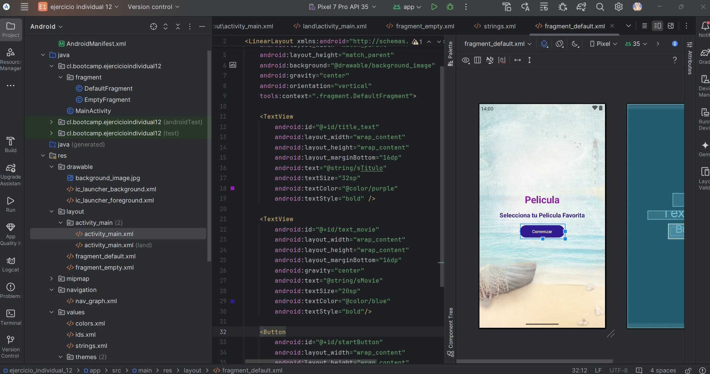

**_<h2 align="center">:vulcan_salute: Ejercicio Individual 13 - Peliculas :computer:</h2>_**

Proyecto realizado según los siguientes requerimientos:

## Varios caminos que seguir.

1. Es hora de que diseñes el __primer fragmento independiente__.
    - En este fragmento debes ingresar __mínimo cuatro opciones__ del producto u elemento que elegiste para crear el proyecto.
    - No olvides que puedes convertir una imagen en un elemento clickable por medio de __android:clickable="true"__.

2. A partir de este primer fragmento van a ramificarse los nuevos, en dónde __la cantidad de fragmento va a depender de la cantidad de elementos elegidos__.

3. No olvides enlazar correctamente la navegación para que no exista ningún inconveniente a la hora de implementar la acción de los fragmentos.
    - __Importante:__ El identificador del layout debe estar marcado por la action que nos ofrece la librería de navegación.

4. La cantidad de enlaces va a depender del número de elementos que seleccionaste.

